# Qualdano System Diagrams

This document provides detailed explanations of the architectural and process diagrams for the Qualdano project.

## 1. High-Level System Architecture
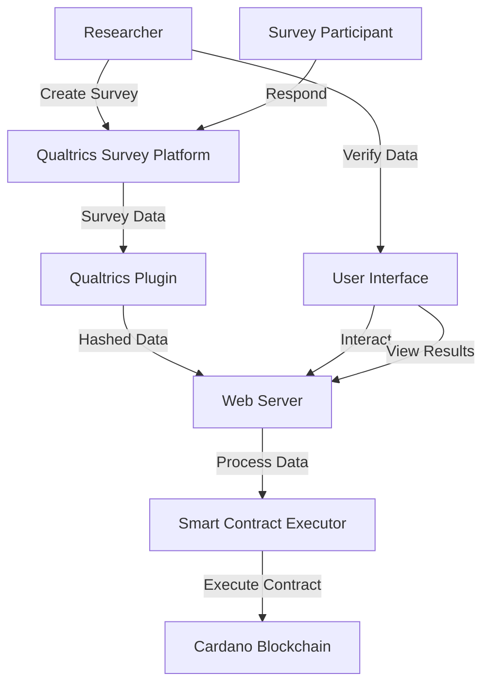

This diagram illustrates the main components of the Qualdano system and their interactions. It shows how data flows from the Qualtrics Survey Platform through our plugin, web server, and ultimately to the Cardano blockchain.

## 2. Data Flow Diagram
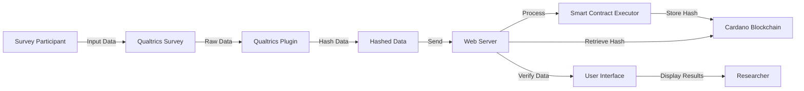

This diagram details how data moves through the Qualdano system, from survey participant input to blockchain storage and verification.

## 3. Qualtrics Plugin Architecture
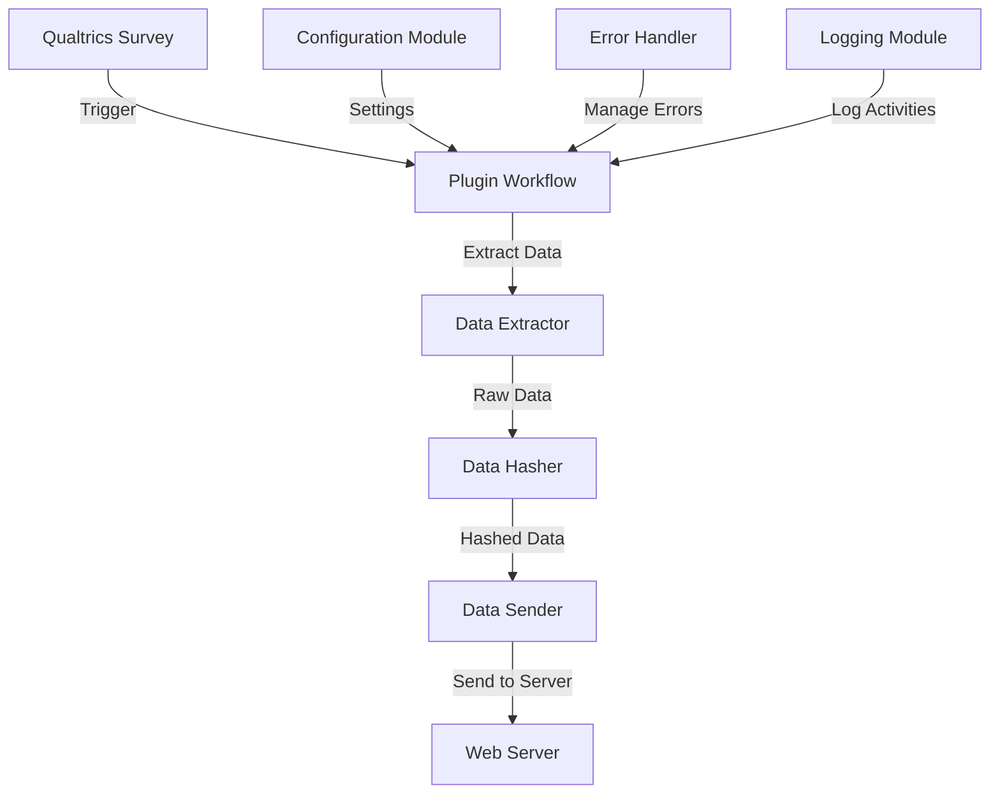

This diagram shows the internal structure of our Qualtrics plugin, including components for data extraction, hashing, and sending to our web server.

## 4. Web Application Architecture
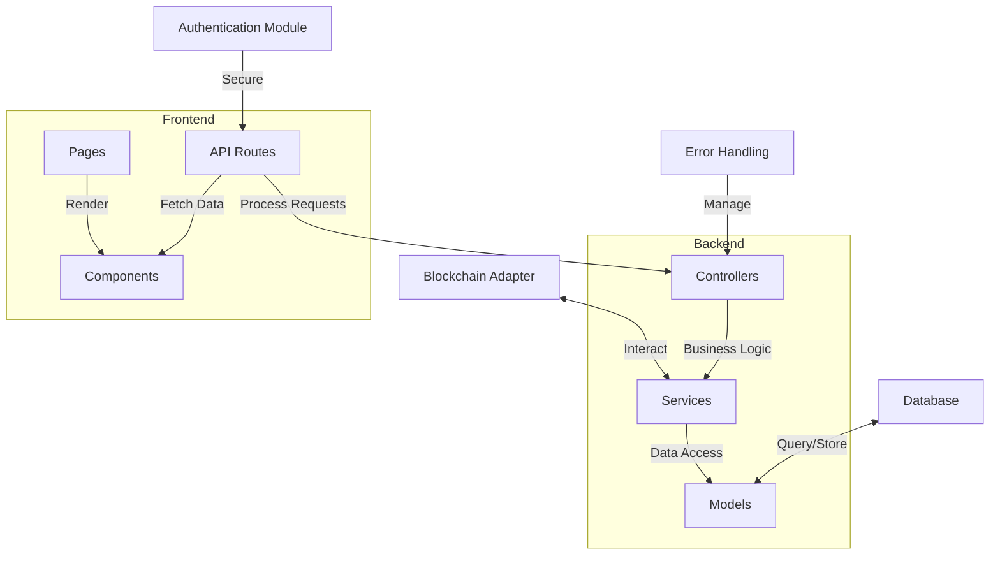

This diagram illustrates the architecture of our Next.js web application, showing both frontend and backend components and their interactions.

## 5. Database Schema
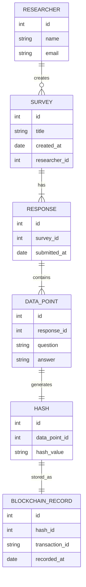

This diagram represents the structure of our database, showing tables and their relationships.

## 6. Cardano Smart Contract Architecture
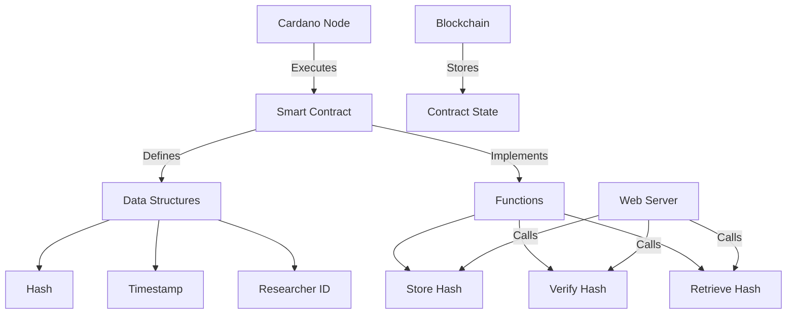

This diagram shows the structure of our smart contracts on the Cardano blockchain, including data structures and functions.

## 7. API Endpoints Diagram
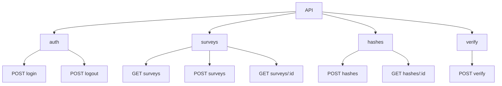

This diagram provides an overview of our API endpoints, showing the structure and available methods.

## 8. User Journey Map
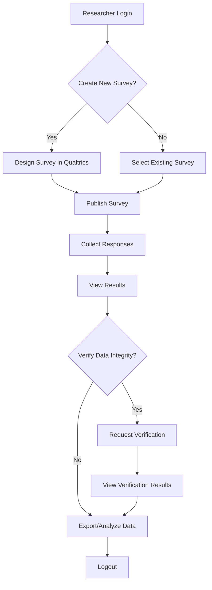

This diagram illustrates the typical user journey through our system, from login to data verification.

## 9. Security Architecture
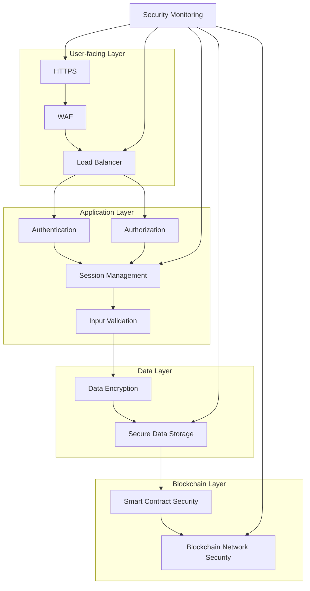

This diagram shows the security measures implemented across different layers of our system.

## 10. Deployment Architecture
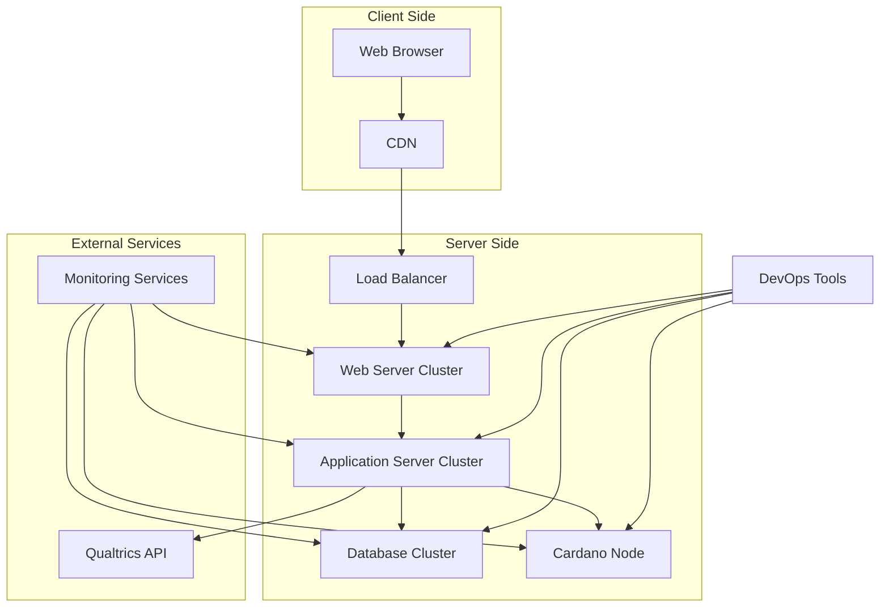

This diagram illustrates how our system is deployed, including server clusters and external services.

## 11. Integration Diagram
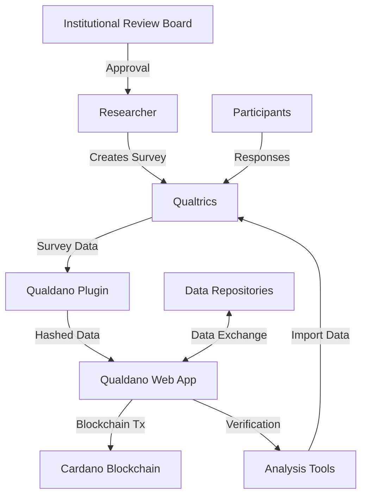

This diagram shows how Qualdano integrates with existing research workflows and tools.

## 12. Blockchain Interaction Sequence Diagram
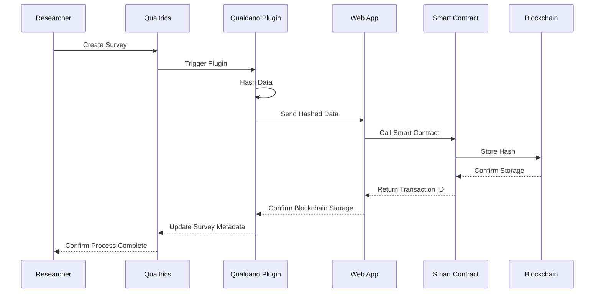

This diagram details the sequence of interactions between system components and the blockchain during a typical operation.

## 13. Error Handling and Recovery Flow
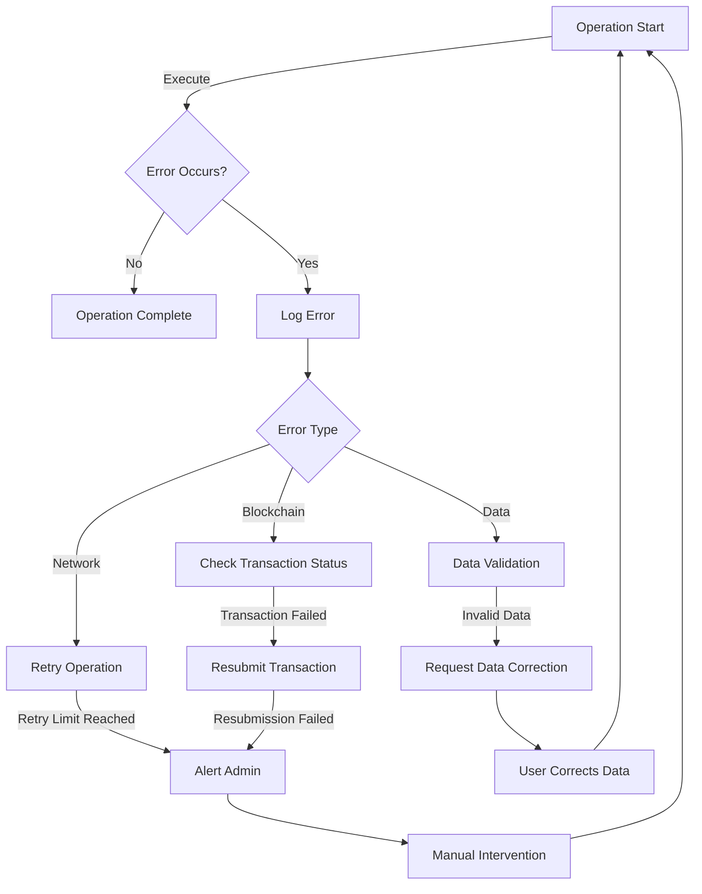

This diagram illustrates how our system handles errors and the recovery processes in place.

## 14. Verification Process Flowchart
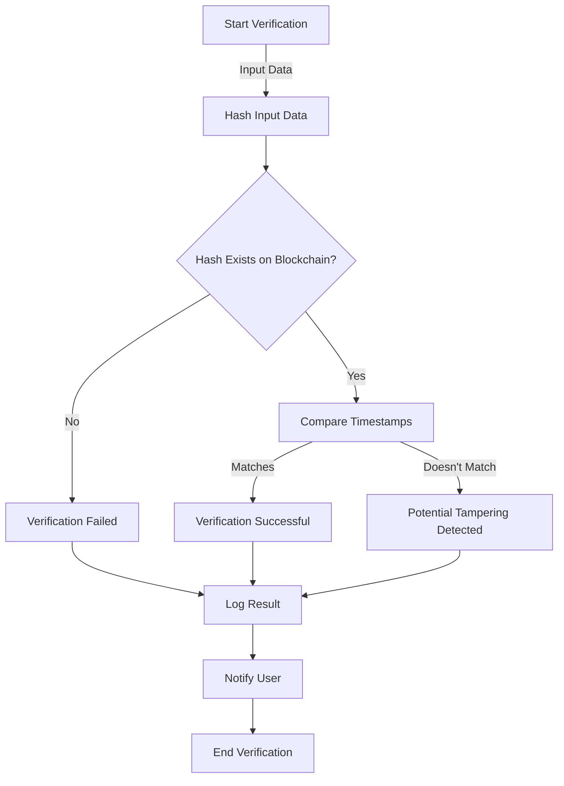

This diagram shows the step-by-step process of verifying data integrity using our system.

## 15. Component Dependency Diagram
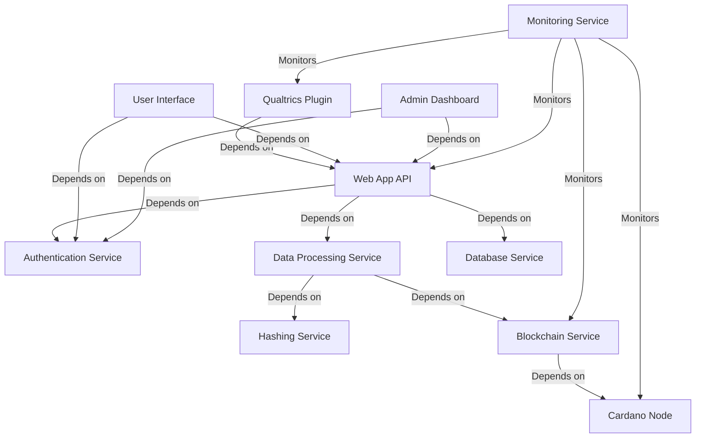

This diagram illustrates the dependencies between different components of our system.

These diagrams provide a comprehensive overview of the Qualdano system architecture and processes. They serve as a reference for development, documentation, and understanding the system's structure and workflows.
